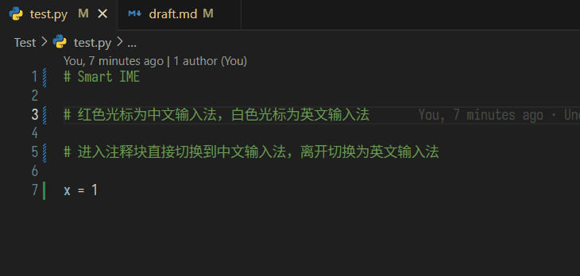

# Smart IME

灵感来自 idea 的 Smart Input，用于智能地进行中英输入法的切换。

**依赖于 [IME and Cursor](https://marketplace.visualstudio.com/items?itemName=beishanyufu.ime-and-cursor) 插件，所以请先进行该插件的配置，例如可以配置中文输入法时显示为红色光标。**

## 依赖

需要安装 [IME and Cursor](https://marketplace.visualstudio.com/items?itemName=beishanyufu.ime-and-cursor) 与 HyperScopes 插件。

## 特性



- 检测到前一个字符是中文时自动切换到中文输入法（默认开启，**这个特性较为耗电，请仔细甄别是否要开启，以及配置触发间隔时间，默认为 2 秒**）；
- 在中文后输入一个空格自动切换到英文输入法（默认开启）；
- 在英文后输入两个空格自动切换到中文输入法（默认未开启）；
- 进入到注释场景时，自动切换为中文输入法，离开时自动切换为英文输入法（参考插件配置里的 `comment` 相关内容）；
- 进入到数学公式时，自动切换为英文输入法，离开时自动切换为中文输入法（参考插件配置里的 `markup.math,meta.math` 相关内容）；
- 离开字符串时，自动切换为英文输入法（参考插件里的 `string` 相关内容，如果要进入字符串后自动切换成中文可以自行配置）；
- 如果当前文档拥有超过 n 个英文字符且没有中文字符，则禁用插件；
  - 只有在切换窗口时重新检测
- 当然，你也可以在文档中加入一个字符串 `DISABLE_SMART_IME`（例如在注释块里写这个字符串），只要识别到当前文档有这个字符串，也会在当前文件禁用插件；
  - 只有在切换窗口时重新检测


## 获取输入法的 key 失败，请检查是否正确设置了 "ObtainIMCmd"

请搜索插件 [IME and cursor](https://marketplace.visualstudio.com/items?itemName=beishanyufu.ime-and-cursor)，并按插件说明进行相应的安装和配置。


## 切换输入法无法切换光标样式

请使用 `shift + space` 切换输入法，而不是使用系统自带的快捷键。搜索插件 [IME and cursor](https://marketplace.visualstudio.com/items?itemName=beishanyufu.ime-and-cursor) 查看更详细的说明。


## 在 remote / SSH / WSL / docker 模式下使用

如果无法在 remote 状态下生效，可以试着先在 remote 删除 Smart IME 以及其依赖的两个插件，然后在 remote 的设置中加入如下设置：

```json
"remote.extensionKind": {
  "draivin.hscopes": ["ui"],
  "beishanyufu.ime-and-cursor": ["ui"],
  "OrangeX4.vscode-smart-ime": ["ui"]
}
```

再重新安装插件即可。


## 目前的问题

- VS Code 并没有给出一个很好的 api 来判断终端是否获得了焦点，因此切换到终端时切换到英文输入法的功能暂时无法实现；
- Commit Message 同理，暂时无法实现；
- Vim 模式的支持可以使用 IME and Cursor 里的配置实现；

## 插件设置

- `smart-ime.warnDisabled`: 是否显示禁用提示
- `smart-ime.disabledOnEnglishTextOverN`: 如果当前文档拥有超过 n 个英文字符且没有中文字符，则禁用插件，默认为 100，值为 -1 时禁用该设置
- `smart-ime.enableChineseSwitchToChinese`: 检测到中文时切换输入法到中文，默认开启
- `smart-ime.enableChineseSwitchToChineseInterval`: 检测到中文时切换输入法到中文的触发间隔，默认 2000 毫秒（即两秒）
- `smart-ime.enableChineseAndSpaceSwitchToEnglish`: 检测到中文+空格时切换输入法到英文，默认开启
- `smart-ime.enableEnglishAndDoubleSpaceSwitchToChinese`: 检测到当前行前有中文，且光标前面是非中文+双空格时切换输入法到中文并删掉一个空格，默认关闭
- `smart-ime.enterScopesSwitchToChinese`: 进入某些 scopes 时切换输入法到中文，用逗号分割，前缀匹配，请使用 `Developer: Inspect Editor Tokens and Scopes` 查看当前位置的 scopes
  - 例如这里默认配置了 `comment` 就可以实现进入注释块时切换到中文输入法的效果
  - 如果配置了 `comment,string`，就可以匹配 Python 的 `comment.line.number-sign.python`（注释）和 `string.quoted.single.python`（字符串），请使用 `Developer: Inspect Editor Tokens and Scopes` 命令查看 scopes
- `smart-ime.enterScopesSwitchToEnglish`: 进入某些 scopes 时切换输入法到英文，用逗号分割，前缀匹配
  - 例如这里默认配置了 `markup.math,meta.math` 就可以实现进入数学公式（markdown 和 latex）时切换到英文输入法的效果
- `smart-ime.leaveScopesSwitchToChinese`: 离开某些 scopes 时切换输入法到中文，用逗号分割，前缀匹配
  - 例如这里默认配置了 `markup.math,meta.math` 就可以实现离开数学公式（markdown 和 latex）时切换到中文输入法的效果
- `smart-ime.leaveScopesSwitchToEnglish`: 离开某些 scopes 时切换输入法到中文，用逗号分割，前缀匹配
  - 例如这里默认配置了 `comment,string` 就可以实现离开注释块和字符串时切换到英文输入法的效果
- 优先级是 **优先英文切换** 和 **优先进入切换**
